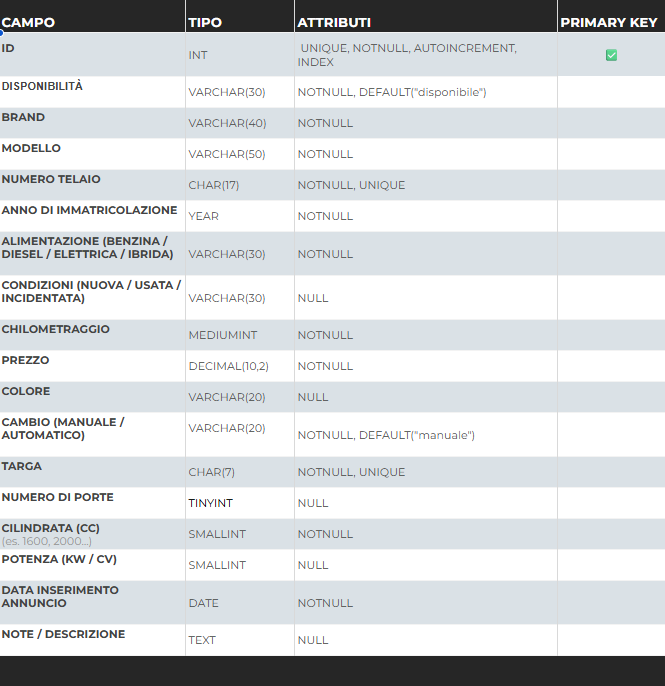

# 🚗 db-first — Auto usate in vendita

Esercizio di modellazione di una tabella per gestire i dati di un concessionario che vende auto usate.  
Ho creato la struttura con i campi principali (marca, modello, anno, chilometraggio, prezzo, ecc.) specificando per ognuno **tipo di dato**, **attributi** e la **chiave primaria**.

